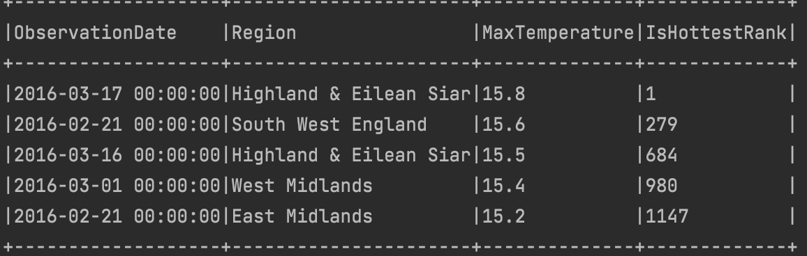
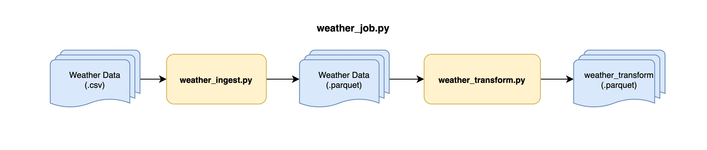

# Weather Data Analysis

## Problem Statement / Description

This is an apache spark job that convert the weather data into parquet format. Set the row group to the appropriate value you see fit
for this data. The converted data should be able to answer the following question.
- Which date was the hottest day?
- What was the temperature on that day?
- In which region was the hottest day?

## Assumptions

1. The source data is kept in `data` directory segregated into sub-directories: `input` and `output`. For the purpose of the test, it doesn't accept arguments.
2. `ScreenTemperature` is considered as the temperature column in the provided weather data. No other features were considered.
3. The hottest day calculation is based on `MAXIMUM ScreenTemperature` at any site within a region.
4. The final temperature data result returns all the rows with a `rank` assigned to it. It is named `IsHottestRank`.
5. `IsHottestRank = 1` is the hottest day and region.

## Output

The result based on the weather .csv data:

- **Hottest Day**: 2016-03-17 00:00:00
- **Temperature**: 15.8
- **Region**: Highland & Eilean Siar

## Project Structure

The project directory structure along with its description

      weather-data-analysis
      |
      |-- conf: Spark Initialization and Configuration
      |-- data: Data directory holding the weather (.csv) file and output parquet files
          |-- input: Weather .csv file is kept here
          |-- output: The output .parquet files that were generated
      |-- documents: Documents to refer including problem statement and job design
      |-- job: Starting Job Entry location (weather_job.py)
      |-- logs: Log directory
      |-- tests: Test location
      |-- transformation: Files to transform the weather data
      |-- requirements.txt

## Job Design

